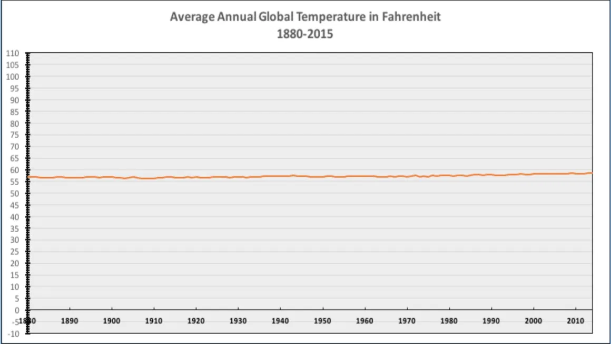

```{r setup, include=FALSE}

# Setup the environment
library(knitr)
knitr::opts_chunk$set(fig.align='center',fig.width=10, fig.height=6, fig.path='Figs/',  warning=FALSE, echo=TRUE, eval=TRUE, message=FALSE)

r = getOption("repos")
r["CRAN"] = "http://cran.us.r-project.org"
options(repos = r)

```

<div class="instructions">

Please complete the following questions and submit the finished Rmd and
HTML file onto Canvas. The exam has a total of 100 points. 

This exam is open-book, you can use any resources available to you. 

HOWEVER, you must finish independently meaning consulting with others on the questions is not allowed.

Don't forget to change name field in the beginning to your **first and last name**. 

If there is anything not clear, please contact Kylen or Ryan

Good luck and have fun! 

</div>


### Question 1 

<div class="question">

Sampling is a way to understand the population parameter of study. No matter how 
carefully a sample is designed, sample errors are unavoidable. Is this statement 
true or false? (3 points)

- True 
- False 

**Your answer: **

**True**

</div>

### Question 2 


<div class="question">

 Central limit theorem (CLT) is one of the most important theorem in
statistics. Which one of the following about the CLT is **wrong**? (3 points)

- According to CLT, if the sample size is large enough (typically larger than 30), 
  the distribution of sample values will approximately follow a normal distribution

- According to CLT, if the sample size is large enough (typically larger than 30),  
  the distribution of sample means will approximately follow a normal distribution

- According to CLT, if the sample size is large enough (typically larger
  than 30), the distribution of the sample mean will approximately follow
  a normal distribution regardless of the distribution of the variable 
  in the underlying population

- According to CLT, the standard deviation of sample mean (standard error) will be
  smaller than the standard deviation of the sample values

**Your answer:**

**According to CLT, if the sample size is large enough (typically larger than 30), the distribution of sample values will approximately follow a normal distribution**

</div>

### Question 3 

<div class="question">

A correlation coefficient is often used to measure the strength of
correlation of two variables. Say we are interested in the relationship
between positive COVID-19 cases and temperature. In a study (hypothetical),
researchers use state level of data of the U.S. and found the correlation
coefficient between these two variables (positive COVID-19 cases and
average temperature of each state) is -0.4. Based on the correlation
coefficient, which one of the following statements is **wrong**? (3 points)

- It means the COVID-19 cases and average temperature are negatively correlated 

- It means as the temperature drops the number of COVID-19 cases tend to increase
  
- It means the temperature drops cause the increase of COVID-19 cases

- It only shows the linear relationship between temperature and COVID-19
  cases, and cannot show the possible non-linear relationship between them

**Your answer:**

**False: It means the temperature drops cause the increase of COVID-19 cases**


</div>


### Question 4 

<div class="question">

In another dimensions, it's possible to have a 3-sided coin: heads, tails, and arms. 
Each of these outcomes has an equal probability (33.33% or 1/3rd). Assume each coin flip is 
independent. Calculate the following probabilities. You can round your answer to 2 decimal places

**A.** The probability of flipping the coin twice and getting at least one heads (3 points)

**Your answer:**


**B.** The probability of flipping the coin three times and *not* getting a heads (3 points)


**Your answer:**


**C.** The probability of flipping the coin three times and getting exactly one of each 
outcome (heads, tails, and arms). Be sure to show your work and/or explain how you came to the answer
(6 points)

**Your answer:**


</div>


### Question 5 

<div class="question">

The enclosed csv file ('ColoradoCounty.csv') contains the COVID-19
related statistics for all Colorado counties. The column
`County_Rate_Per_100_1000` indicate the positive rate for each county
(number of positive cases per 100,000 population) and the column `COUNTY`
names of each county. Treat this dataset as a **sample**
Based on this dataset, please answer the following questions:

**A.** What are the mean, median, and standard deviation of the
positive rate (column `County_Rate_Per_100_1000`)? You can use R to answer
the question.  (7 points)

**Your answer:**

```{r}
# load the csv file
coloradoCovid<- read.csv('./ColoradoCounty.csv')

# type your code here to answer the question

```

**B.** Please describe the distribution of the positive rate (column 'County_Rate_Per_100_1000') 
by plotting the histogram. Are the data right skewed, left skewed, or symmetric?
In the histogram, what is the approximate range of the values that most counties tend to have 
(aka the mode)? Are there outliers? If so,please describe which counties are outliers. 
You can use R to answer the question. (7 points)

**Your answer:**

```{r}
# load the csv file
coloradoCovid<- read.csv('./ColoradoCounty.csv')

# type your code here to answer the question


```

**C.** We are interested in knowing how Boulder county stands in the state. The
positive rate for Boulder county is 1527.06. Please calculate what
percentage of the counties have lower positive rate than Boulder. You can use 
R to answer the question. (7 points)

**Your answer:**

```{r}
# load the csv file
coloradoCovid<- read.csv('./ColoradoCounty.csv')

# type your code here to answer the question

```
 
 </div>

### Question 6

<div class="question">

Let's continue to use the previous COVID-19 file for the state of Colorado ('ColoradoCounty.csv'). 
The column 'County_Rate_Per_100_1000' indicate the positive rate for each county 
(number of positive cases per 100,000 population). Based on the dataset, please answer the following questions:


**A.** Please calculate the 95% confidence interval of the mean positive rate
of the Colorado state. You can use R code to answer the question. (7 points)

**Your answer:**

```{r}

# load the csv file
coloradoCovid<- read.csv('./ColoradoCounty.csv')

# add your code here:

```

**B.** Please interpret what this confidence interval means? What does it tell us
about the population mean? (7 points)

**Your answer:**


</div>

<div class="question">


### Question 7

In the ColoradoCounty.csv file, the variable `Rural` says whether the county is rural or not. 
"1" means it is rural, "0" means it is urban.


**A.** Write appropriate null and alternative hypotheses for comparing the mean positivity
rate  (column 'County_Rate_Per_100_1000') between rural and urban counties (5 points)

**Your answer:**


**B.** Run a two-sample t-test comparing the positivity rate for rural vs urban counties. 
Interpret the result with alpha=0.05. Can we reject the null hypothesis? 
Is the mean positivity rate different between rural and urban counties? (9 points)

**Your answer:**

```{r}

# load the csv file
coloradoCovid<- read.csv('./ColoradoCounty.csv')


# add your code here:


```

</div>


### Question 8

<div class="question">

The enclosed csv file ('hate_crimes.csv') is a dataset of hate related crimes that 
happens in each state of the United States (excluding Hawaii). The column 
`avg_hatecrimes_per_100k_fbi` is the column indicating the average hate crimes 
per 100k population for each state; the column `median_household_income` 
indicates the median household income and `gini_index` indicates the Gini 
index for each state (a measure of economic inequality)

Based on the data, please answer the following questions:

**A.** Which of the two variables, household income and Gini index, is better
correlated with the hate crimes rate? You can use R to answer the question, 
but be sure to also state your answer clearly. (5 points)

**Your answer:**

```{r}
# load the csv file
crimes <- read.csv('./hate_crimes.csv')

# add your code here:

```


**B.** Using the variable that is better correlated with the hate crime rates,
please make a scatter plot between the variable and the hate crime rates, 
and add a regression line on the plot. What is the slope and the intercept of
the regression line? Please write the regression line in the format of y =
a + bx. (7 points)

**Your answer:**

```{r}
# load the csv file
crimes <- read.csv('./hate_crimes.csv')

# add your code here:

```

**C.** Based on the previous analysis, how would you interpret the relationship
   between the chosen variable and the hate crimes? (7 points)

**Your answer:**


**D.** The dataset we used is for the states of the U.S. Can the relationship
   we found with the state level data be the applicable to all the
   counties of the U.S.? Please explain why or why not. (5 points)

**Your answer:**


</div>


### Question 9

<div class="question">

A patient goes to see a doctor. The doctor performs a test with 90 percent
reliability--that is, 90 percent of people who are sick test positive and
90 percent of the healthy people test negative. The doctor knows that only
1 percent of the people in the country are sick. Now the question is: if
the patient tests positive, what are the chances the patient is sick?
Please briefly explain how did you get the answer. (*Hint: Bayes' rule and you can use R for the calculation*) (8 points)

**Your answer:**


```{r}
# Type your code here:


```


</div>


### Question 10

<div class="question">

The following plot (linked on Canvas in the assignment) shows the changes of the 
average annual global temperature (in Fahrenheit) since 1880. 
Please examine this plot and describe the possible problems with it.  (3 points)



**Your answer:**

The Y-axis is greatly exaggerated, and makes obscures the apparent (squinting as I look at the graph here) 3-4 degree increase in average temperature. 3-4 degrees of global warming is massively impactful an the planet, and this plot seems to be saying that hardly any obsevable change has occurred (a significant increase on a plot at this scale would meen the earth was scorched earth, or an ice cube) 

</div>

